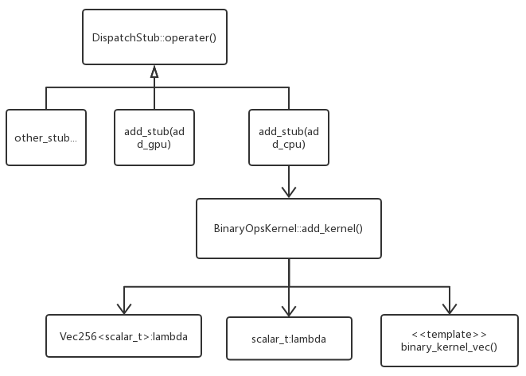

# 加法运算核

#### 概述

本篇希望能够借由对有步幅的张量（strided tensor）的加法`torch.add(x, y)`底层代码的阅读与研究，来了解PyTorch后端所用的线性计算库中有关元素间（element wise）计算的总体结构。

#### 输出空间分配（output allocation）

一般而言，一个运算都会注册三个算子

add_out 为预分配的输出方式

add_ 为就地方式（inplace）

add “这只是一个算子的普通的旧功能版本”

> 大部分时间，abs_out 是真正的主力，abs 和 abs_ 只是围绕 abs_out 的薄弱 wrapper；但有时候也可为每个案例编写专门的实现。

```c++
// pytorch\aten\src\ATen\native\BinaryOps.cpp

DEFINE_DISPATCH(add_stub); // 定义调度

Tensor& add_out(Tensor& result, const Tensor& self, const Tensor& other, Scalar alpha) {
  // ...
  at::assert_no_internal_overlap(result, "add");
  auto iter = TensorIterator::binary_op(result, self, other); // build
  add_stub(iter->device_type(), *iter, alpha); // 调用计算核
  return result;
}

Tensor add(const Tensor& self, const Tensor& other, Scalar alpha) {
  // ...
}

Tensor& add_(Tensor& self, const Tensor& other, Scalar alpha) {
  return native::add_out(self, self, other, alpha);
}
```

这与Nd4j很相似：

```java
/**
 * @param x 输入1
 * @param y 输入2
 * @param z 输出
 */
BaseOp(INDArray x, INDArray y, INDArray z);
```


#### 加法计算的调度注册

```c++
// pytorch\aten\src\ATen\native\cpu\BinaryOpsKernel.cpp

namespace at { namespace native {
namespace {

using namespace vec256;

void add_kernel(TensorIterator& iter, Scalar alpha_scalar) {
  if (iter.dtype() == ScalarType::Bool) {
    // ...
  } else {
    AT_DISPATCH_ALL_TYPES(iter.dtype(), "add_cpu", [&]() {
    auto alpha = alpha_scalar.to<scalar_t>();
    auto alpha_vec = Vec256<scalar_t>(alpha);
    binary_kernel_vec(iter,
      [=](scalar_t a, scalar_t b) -> scalar_t { return a + alpha * b; }, 
      [=](Vec256<scalar_t> a, Vec256<scalar_t> b) {
        return vec256::fmadd(b, alpha_vec, a);
      });
    }); // 使用AT_DISPATCH_ALL_TYPES 宏执行 dtype 调度
  }
}
} // anonymous namespace
    
REGISTER_DISPATCH(add_stub, &add_kernel); // 调度注册
    
}} // namespace at::native
```

`scalar_t`: 标量类型，例如：

```c++
// pytorch\aten\src\TH\THGenerateFloatType.h

#define scalar_t float
```

`add_kernel`里的`alpha`不是很好理解，这里乘法和除法反而更易阅读。乘法调用`binary_kernel_vec`的参数：

```c++
      binary_kernel_vec(iter,
        [=](scalar_t a, scalar_t b) -> scalar_t { return a * b; },
        [=](Vec256<scalar_t> a, Vec256<scalar_t> b) {
          return a * b;
        });
```

#### 二元向量化运算核

```c++
// pytorch\aten\src\ATen\native\cpu\Loops.h

namespace at { namespace native { namespace {

using namespace vec256;

template <typename func_t, typename vec_func_t>
void binary_kernel_vec(TensorIterator& iter, func_t op, vec_func_t vop) {
  using traits = function_traits<func_t>;
  // ...
  iter.for_each([&](int ntensor, char** data, const int64_t* strides, int64_t n) {
    if (is_contiguous<traits>(strides)) { // 判断Tensor的“性状”
      vectorized_binary_loop(data, n, op, vop);
    } else if (is_contiguous_scalar<traits, 1>(strides)) {
      vectorized_binary_loop_s1(data, n, op, vop);
    } else if (is_contiguous_scalar<traits, 2>(strides)) {
      vectorized_binary_loop_s2(data, n, op, vop);
    } else {
      binary_loop(data, strides, 0, n, op);
    }
  });
}

}}}  // namespace at::native::<anonymous>

```
`TensorIterator::for_each`所用到的函数模板：

```c++
// pytorch\aten\src\ATen\native\TensorIterator.cpp 

  // The inner-loop function operates on the fastest moving dimension. It
  // implements element-wise operations in terms of 1-d strided tensors.
  //
  // Arguments:
  //  ntensors: number of operands
  //  data: data pointers for each operand (length `ntensors`)
  //  strides: stride for each operand (length `ntensors`)
  //  size: size of inner loop
  //
  // The `size` often matches shape[0], but may be smaller due to
  // parallelization of the inner loop.
  using loop_t = std::function<void(int ntensors, char** data, const int64_t* strides, int64_t size)>;
  using loop2d_t = std::function<void(int ntensors, char** data, const int64_t* strides, int64_t size0, int64_t size1)>;
```

`iter.for_each`最终在这里得到执行：

```c++
// pytorch\aten\src\ATen\native\TensorIterator.cpp

void TensorIterator::for_each(const loop2d_t& loop) {
  // ...
    
    // 并行化方法
    at::parallel_for(0, numel, internal::GRAIN_SIZE, [&](int64_t begin, int64_t end) {
      serial_for_each(loop, {begin, end});
    });
  // ...
}

void TensorIterator::serial_for_each(const loop2d_t& loop, Range range) const {
  // ...
    auto counter = DimCounter(shape_, range);
    while (!counter.is_done()) {
      auto ptrs = get_data_ptrs(base_ptrs, counter.values);
      auto step = counter.max_2d_step();
      loop(ntensors(), ptrs.data(), strides.data(), step[0], step[1]);
      counter.increment(step);
    }
  // ...
}
```

回顾`loop` :

```c++
op = [=](scalar_t a, scalar_t b) -> scalar_t { return a + alpha * b; }; 
vop = [=](Vec256<scalar_t> a, Vec256<scalar_t> b) {
        return vec256::fmadd(b, alpha_vec, a); // return a * b;
      });

vectorized_binary_loop(data, n, op, vop);
```

`vectorized_binary_loop`函数定义：

```c++
// pytorch\aten\src\ATen\native\cpu\Loops.h

#define VEC_HEADER(func_t) \
  using traits = binary_function_traits<func_t>; \
  using scalar_t = typename traits::result_type; \
  using Vec = Vec256<scalar_t>;

#define VEC_LOOP_HEADER(func_t, data) \
  VEC_HEADER(func_t) \
  char* out_ptr = data[0]; \
  const char* in1_ptr = data[1]; \
  const char* in2_ptr = data[2];

// computes out = op(in1, in2)
template <typename func_t, typename vec_func_t>
static inline void vectorized_binary_loop(char** data, int64_t n, func_t op, vec_func_t vop) {
  VEC_LOOP_HEADER(func_t, data) // 声明输入输出Tensor的指针：in1_ptr, in2_ptr, out_ptr
  int64_t i = 0;
  for (; i <= n - 2 * Vec::size(); i += 2 * Vec::size()) {
    auto a1 = Vec::loadu(in1_ptr + i * sizeof(scalar_t));
    auto a2 = Vec::loadu(in1_ptr + (i + Vec::size()) * sizeof(scalar_t));
    auto b1 = Vec::loadu(in2_ptr + i * sizeof(scalar_t));
    auto b2 = Vec::loadu(in2_ptr + (i + Vec::size()) * sizeof(scalar_t));
    auto out1 = vop(a1, b1); // lambda表达式执行
    auto out2 = vop(a2, b2);
    out1.store(out_ptr + i * sizeof(scalar_t));
    out2.store(out_ptr + (i + Vec::size()) * sizeof(scalar_t));
  }
  int64_t strides[] = { sizeof(scalar_t), sizeof(scalar_t), sizeof(scalar_t) };
  binary_loop(data, strides, i, n, op);
}
```

`binary_loop`定义：

```c++
// pytorch\aten\src\ATen\native\cpu\Loops.h

#define LOOP_HEADER(func_t, data, strides) \
  // ...
  char* out_ptr = data[0]; \
  const char* in1_ptr = data[1]; \
  const char* in2_ptr = data[2]; \
  int64_t s0 = strides[0], s1 = strides[1], s2 = strides[2];

// Basic loop binary operation (two inputs, one output). May be auto-vectorized
// by the compiler.
template <typename func_t>
static inline void binary_loop(char** data, const int64_t* strides, int64_t i, int64_t n, func_t op) {
  LOOP_HEADER(func_t, data, strides) // 声明输入输出Tensor的指针、步幅
  for (; i < n; i++) {
    arg1_t in1 = *(arg1_t*)(in1_ptr + i * s1); // 步幅和原生指针相关的计算
    arg2_t in2 = *(arg2_t*)(in2_ptr + i * s2);
    arg0_t out = op(in1, in2); // lambda表达式执行
    *(arg0_t*)(out_ptr + i * s0) = out;
  }
}
```

#### PyTorch自动CPU并行计算

##### 回顾

对于`TensorIterator`的迭代，PyTorch提供了自动CPU并行优化方法

```c++
// pytorch\aten\src\ATen\native\TensorIterator.cpp

void TensorIterator::for_each(const loop2d_t& loop) {
  // ...
    
    // 并行化方法
    at::parallel_for(0, numel, internal::GRAIN_SIZE, [&](int64_t begin, int64_t end) {
      serial_for_each(loop, {begin, end});
    });
  // ...
}
```

##### ez.yang的演讲


> 在 CPU 上，你通常需要并行化你的代码。过去，这通常是通过直接在你的代码中添加 OpenMP pragma 来实现。

##### `parallel_for`函数声明

```c++
template <class F>
inline void parallel_for(
    const int64_t begin,
    const int64_t end,
    const int64_t grain_size,
    const F& f);
```

#### 要点总结

- 就地操作与复制操作的区别只在于高级API的实参传递上。

- 对于开发元素间（element wise）计算，首先需要定义调度（dispatch），并作为调用接口，而后设计并调用计算核，在计算核的lambda表达式中定义向量与标量的计算方式，不同计算的差异也主要体现在这里。另外，不同的数据类型的计算方法差异也在这里。

   
   
- 底层的计算模板中，步幅（stride）的概念得到体现。步幅的具体规则可以参考[小泽给出的知乎文章](<https://zhuanlan.zhihu.com/p/67834038>)以及[Stride Visualizer](https://ezyang.github.io/stride-visualizer/index.html)。

- 底层的计算模板中，一般通过取Tensor的迭代器的方式进行操作。

- 对基于步幅的计算操作，PyTorch封装的比较好，如果我们要自己开发线性计算库，建议我们参考其思路后自行编写相关函数。

